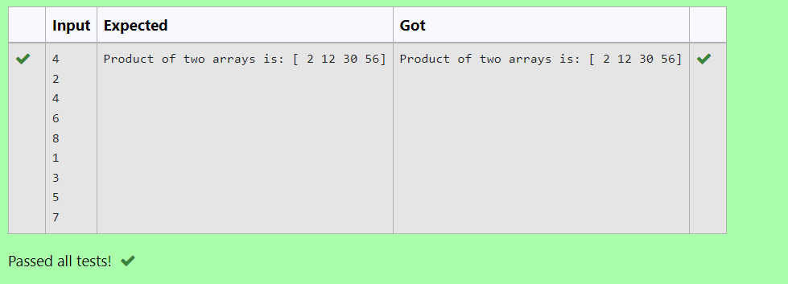

# Multiplying-two-matrix

## AIM:
To write a python program for Multiplying two matrices.
## ALGORITHM:

### Step 1:
Start python program.
### Step 2:
Import numpy and Create two empty lists.
### Step 3:
Get two matrices from the user using append.
### Step 4:
Multipy the two matrices.
### Step 5:
Display the result.
## PROGRAM: 
```
Created by : Harini.B
Register number : 212221230035
import numpy as np
l1,l2=[],[]
val=int(input())
for i in range(val):
    l1.append(int(input()))
for i in range(val):
    l2.append(int(input()))
value1=np.array(l1)
value2=np.array(l2)
result=value1*value2
print("Product of two arrays is:",result)
```

## OUTPUT:


## RESULT:
A python program for Multipying two matrices has been created successfully.